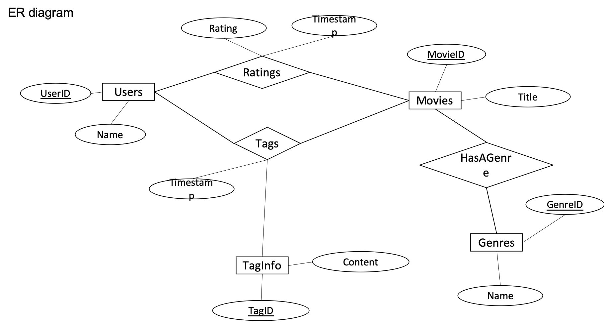

# Movie Database Project

This project focuses on designing and implementing a movie database with specific attributes and functionalities. The database includes seven main tables: users, movies, taginfo, genres, ratings, tags, and hasagenre.

## Background

In this database, a movie is defined by two attributes: `id` and `title`. For example, a movie record appears as follows: `54796, 2 Days in Paris (2007)`.

Movies can be categorized into multiple genres, selected from a predefined set including Action, Adventure, Animation, Children’s, Comedy, Crime, etc. A movie may belong to one or more genres or none at all.

Users can provide ratings on a 5-star scale (0-5) for a movie. Each user can rate a movie once, and the database logs each rating operation. The database enforces not allowing out-of-range ratings.

Additionally, users can assign tags to movies. A tag is a single word or short phrase, and a user can tag a movie multiple times. The meaning, value, and purpose of a tag are determined by each user. The database logs each tagging operation.

## ER Diagram

## Tables

1. **users:**
   - `userid` (int, primary key): Unique identifier for the user.
   - `name` (text): Name of the user.

2. **movies:**
   - `movieid` (integer, primary key): Unique identifier for the movie.
   - `title` (text): Title of the movie.

3. **taginfo:**
   - `tagid` (int, primary key): Unique identifier for the tag.
   - `content` (text): Content of the tag.

4. **genres:**
   - `genreid` (integer, primary key): Unique identifier for the genre.
   - `name` (text): Name of the genre.

5. **ratings:**
   - `userid` (int, foreign key): User who rated the movie.
   - `movieid` (int, foreign key): Movie being rated.
   - `rating` (numeric): Rating given to the movie (0-5 scale).
   - `timestamp` (bigint): Time of the rating in seconds since January 1, 1970 (UTC).

6. **tags:**
   - `userid` (int, foreign key): User assigning the tag to a movie.
   - `movieid` (int, foreign key): Movie being tagged.
   - `tagid` (int, foreign key): Tag being assigned.
   - `timestamp` (bigint): Time of the tagging in seconds since January 1, 1970 (UTC).

7. **hasagenre:**
   - `movieid` (int, foreign key): Movie having a genre.
   - `genreid` (int, foreign key): Genre assigned to the movie.

## Requirements

This phase of the project involves creating and loading data into the specified tables based on the database design.
